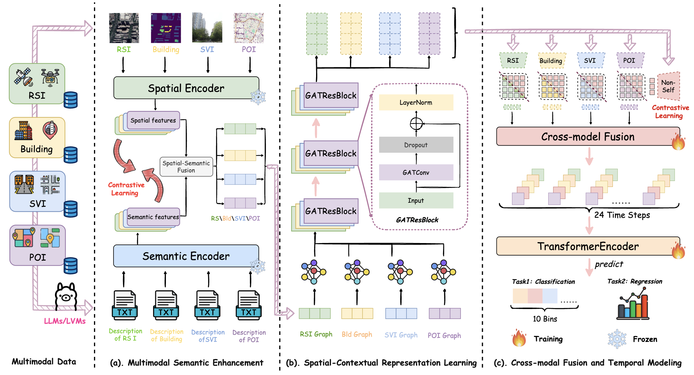

# Large Model Enhanced Multimodal Representations (LMEMR)

**LMEMR** is a novel framework for accurately predicting fine-grained urban mobility patterns using only static geospatial data. By leveraging large vision-language models and advanced multimodal learning, LMEMR offers a scalable, privacy-friendly solution for smart city applications.

## 🔍 Overview

Accurately predicting fine-grained urban mobility is essential for optimizing transportation, accessibility, and urban management. However, existing approaches often depend on high-cost, privacy-sensitive dynamic data such as trajectories or signaling records, limiting their scalability and cross-city applicability.

This study proposes the **Large Model Enhanced Multimodal Representations (LMEMR)** framework to learn hourly parcel-level mobility dynamics solely from static geospatial data, including:
- Remote sensing imagery
- 3D building footprints
- Street view imagery 
- Points of interest (POI)

## 🤖 FrameWork



## ⚙️ Key Features

### 🌐 **Static Data Driven**
Predicts dynamic mobility without requiring real-time tracking or personal data, ensuring user privacy and enabling broader deployment.

### 🧠 **Semantic Enhancement with Large Models**
Employs large vision-language models (VLMs/LLMs) to generate natural-language descriptions for each modality, enriching static inputs with human-understandable semantics.

### 🔗 **Dual-Level Contrastive Learning**
Aligns features both within and across modalities through a dual-level contrastive strategy, reducing semantic gaps and improving multimodal consistency.

### 📊 **Spatial-Temporal Modeling**
- **Spatial Dependencies**: Modeled via a Graph Attention Network (GAT).
- **Temporal Dynamics**: Captured using a Transformer encoder to generate 24-hour mobility sequences.


## 🔧 Applications

LMEMR enables effective urban planning and management in scenarios where dynamic data is unavailable or restricted, offering an interpretable and transferable solution for:
- Traffic forecasting
- Public transit optimization
- Urban accessibility analysis
- Smart infrastructure planning

## 🚀 Getting Started

To use this framework:
1. Organize your static geospatial data (RSI, building footprints, street views, POIs) by region.
2. Extract multimodal features and generate textual descriptions using VLMs/LLMs.
3. Train the model using `TrainWithGraph.py` and `main.py`.

See the [model/](model/) directory for full implementation details.

## 📂 Repository Structure

```
project-root/
├── data/region_ID/
│   ├── ID_Building.png
│   ├── ID_RSI.png
│   ├── ID_POI.csv
│   └── streetviews/
└── model/
    ├── DataSet.py
    ├── GATNetwork.py
    ├── Multimodal_Semantic_Enhancer.py
    ├── TrainWithGraph.py
    ├── main.py
    └── ...
```

## 🔖 Citation

If you find this work useful in your research, please cite:

```bibtex
@article{lmemr2025,
  title={Large Model Enhanced Multimodal Representations for Fine-Grained Urban Mobility Prediction},
  author={Author, A. and Author, B.},
  journal={xx},
  year={2025}
}
```
